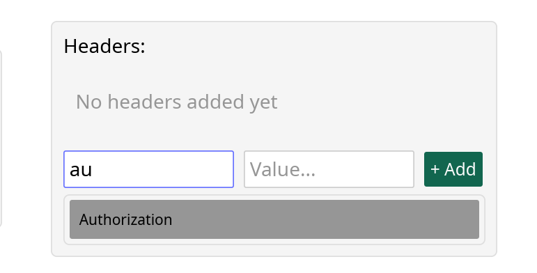

# rastman
### open-source API client

stack:
  - rust lang
  - iced gui library
  - tokio
  - reqwest
  - serde_json

-

* Стрелки вниз/вверх меняют тему, пробел сбрасывает.
* В боди стили - это стили подсветки
* Если json невалиден, отправляется текстом в body

